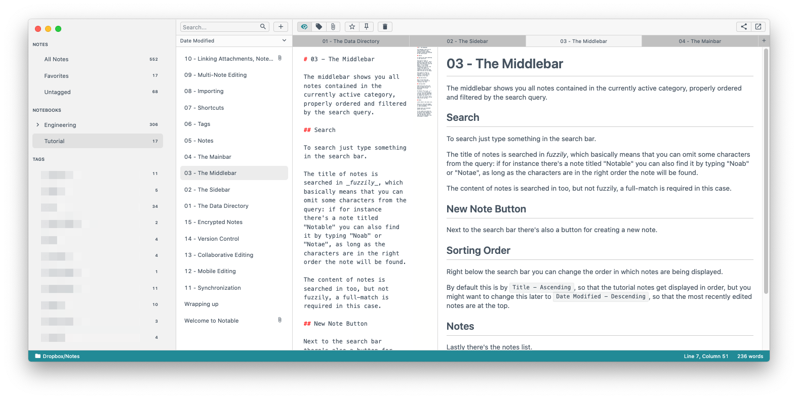

# Absent Minded (Light)

This is a theme for the most-excellent markdown note taking app [Notable](https://notable.app).

This theme is based on the Light version of the [Rainglow "Absent" Theme](https://rainglow.io/preview/#absent).

## Screenshot

## Features
- Markdown symbols are colored bright red.
    - That makes it easy to locate headers etc when scrolling through/authoring very large markdown files.
- The "active" note tab is lighter than the inactive tabs.
    - Notable Alpha 1.9.0-alpha.19 has it the other way around.
- The bottom bar is a teal-ish green.
    - I have no other apps which use that color, so it makes the Notable window easy to find in a desktop full of open windows.

## Installation

For reference, the `abent_minded.json` file contains all the boilerplate of a bare-bones Notable global settings JSON file, but in reality all you want is the `"absent_minded-light"` object (located inside the `"themes":"installed"` object).

- In Notable, open your Settings (e.g. on MacOS: Notable -> Settings)
- Select the `"abent_minded_light"` object from the `abesent_minded.json` file in this repo.
- Paste it into the `"installed"` object in **your** settings JSON (which is inside the `"themes"` object).
    - Mind your commas (JSON requires a comment between each object, and disallows a trailing comma).
- Close Settings.
- Select the theme from the Notable menu (e.g. on MacOS: Notable -> Themes -> Absent Minded (Light))